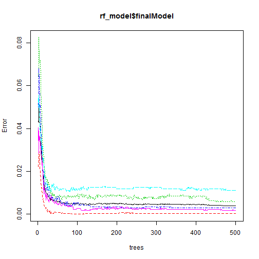
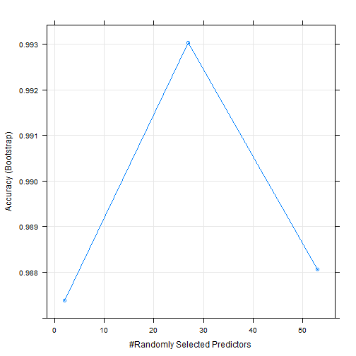

### Synopsis

This report is based on the [Weight Lifting Exercise Dataset](http://groupware.les.inf.puc-rio.br/har). The dataset is collected from six participants with accelerometers on the belt, forearm, arm, and dumbell asked to perform one set of 10 repetitions of the Unilateral Dumbbell Biceps Curl in **five different fashions**: exactly according to the specification (**Class A**), throwing the elbows to the front (**Class B**), lifting the dumbbell only halfway (**Class C**), lowering the dumbbell only halfway (**Class D**) and throwing the hips to the front (**Class E**).

The purpose of this report is to quantify how well they do the exercise from the accelerometers measurements. We will try to predict which class each particular activity belongs.

### Summary
We have used R caret packages to build different regression models, including random forests, gradient boosting and K-nearest neighbors classifier. As observed,
random forest has best accuracy and is the most computationally expensive.


### Data Processing

First, we downloaded the training and testing data set.

```r
set.seed(12321)
base_URL<-"http://d396qusza40orc.cloudfront.net/predmachlearn/pml-training.csv"
test_URL<-"http://d396qusza40orc.cloudfront.net/predmachlearn/pml-testing.csv"
base<-read.csv(base_URL,na.strings=c("NA",""))
test<-read.csv(test_URL,na.strings=c("NA",""))
dim(base);dim(test)
```

```
## [1] 19622   160
```

```
## [1]  20 160
```

The dataset contains 160 variables. The first 6 columns are indices, names and timestamps which should be removed before prediction. Also, since some variables have NA values, we decided to remove this kind of variables first instead of imputing to see how prediction model work.

We have also separated the training into two groups for later cross validation.


```r
# remove id, names, timestamps
names(base)[1:6]
```

```
## [1] "X"                    "user_name"            "raw_timestamp_part_1"
## [4] "raw_timestamp_part_2" "cvtd_timestamp"       "new_window"
```

```r
base<-base[,7:160]
test<-test[,7:160]

# remove all columns with NAs
full_data<-apply(!is.na(base),2,sum)== dim(base)[1]
base<-base[,full_data]
test<-test[,full_data]

dim(base)
```

```
## [1] 19622    54
```

```r
# split data
inTrain<-createDataPartition(y=base$classe,p=0.5,list=FALSE)
training <- base[inTrain,]
validation <- base[-inTrain,]
```

### Prediction Models

The dataset has only 54 variables after processing. Three different prediction methods were built as below:

#### *Method 1: Random forests*

First model is random forests with R caret package default settings.


```r
cache = TRUE
ptm <- proc.time()
rf_model<-train(classe~.,data=training,method="rf")
proc.time() - ptm
```

```
##    user  system elapsed 
## 6505.25   32.00 6554.58
```


```r
pred1 <- predict(rf_model, validation)
confusionMatrix(pred1, validation$classe)
```

```
## Confusion Matrix and Statistics
## 
##           Reference
## Prediction    A    B    C    D    E
##          A 2790   11    0    0    0
##          B    0 1885    3    0    2
##          C    0    2 1707   28    0
##          D    0    0    1 1580    8
##          E    0    0    0    0 1793
## 
## Overall Statistics
##                                           
##                Accuracy : 0.9944          
##                  95% CI : (0.9927, 0.9958)
##     No Information Rate : 0.2844          
##     P-Value [Acc > NIR] : < 2.2e-16       
##                                           
##                   Kappa : 0.9929          
##  Mcnemar's Test P-Value : NA              
## 
## Statistics by Class:
## 
##                      Class: A Class: B Class: C Class: D Class: E
## Sensitivity            1.0000   0.9932   0.9977   0.9826   0.9945
## Specificity            0.9984   0.9994   0.9963   0.9989   1.0000
## Pos Pred Value         0.9961   0.9974   0.9827   0.9943   1.0000
## Neg Pred Value         1.0000   0.9984   0.9995   0.9966   0.9988
## Prevalence             0.2844   0.1935   0.1744   0.1639   0.1838
## Detection Rate         0.2844   0.1922   0.1740   0.1611   0.1828
## Detection Prevalence   0.2855   0.1927   0.1771   0.1620   0.1828
## Balanced Accuracy      0.9992   0.9963   0.9970   0.9907   0.9972
```

The result from random forests model is quite good. We have achieved **99%** accuracy while doing cross validation, which means the out of sample error is **less than 1%**.


#### *Method 2: Gradient Boosting*

The second model is graident boosting with R caret default setting.


```r
ptm <- proc.time()
gbm_model<- train(classe~., data=training, method="gbm", verbose = FALSE)
proc.time()-ptm
```

```
##    user  system elapsed 
## 3103.56    4.22 3137.78
```


```r
pred2 <- predict(gbm_model, validation)
confusionMatrix(pred2, validation$classe)
```

```
## Confusion Matrix and Statistics
## 
##           Reference
## Prediction    A    B    C    D    E
##          A 2785   20    0    0    0
##          B    3 1861   17   18   15
##          C    0   14 1686   32    5
##          D    2    3    8 1554   21
##          E    0    0    0    4 1762
## 
## Overall Statistics
##                                           
##                Accuracy : 0.9835          
##                  95% CI : (0.9808, 0.9859)
##     No Information Rate : 0.2844          
##     P-Value [Acc > NIR] : < 2.2e-16       
##                                           
##                   Kappa : 0.9791          
##  Mcnemar's Test P-Value : NA              
## 
## Statistics by Class:
## 
##                      Class: A Class: B Class: C Class: D Class: E
## Sensitivity            0.9982   0.9805   0.9854   0.9664   0.9773
## Specificity            0.9972   0.9933   0.9937   0.9959   0.9995
## Pos Pred Value         0.9929   0.9723   0.9706   0.9786   0.9977
## Neg Pred Value         0.9993   0.9953   0.9969   0.9934   0.9949
## Prevalence             0.2844   0.1935   0.1744   0.1639   0.1838
## Detection Rate         0.2839   0.1897   0.1719   0.1584   0.1796
## Detection Prevalence   0.2859   0.1951   0.1771   0.1619   0.1800
## Balanced Accuracy      0.9977   0.9869   0.9895   0.9811   0.9884
```

We have reached **98%** accuracy while doing cross validation with gradient boosting model.

#### *Method 3: K-Nearest Neighbor Classifier *

The final model is the K-nearest neighbor classifier. As all variables have a different range, we have configured preProcess parameter in trainControl() for data standardization. Also, to increase accuracy, we have also enabled repeated cross-validation.


```r
ptm <- proc.time()
trctrl <- trainControl(method = "repeatedcv", number = 10, repeats = 3)
knn_model<- train(classe~., data=training, method="knn", trControl=trctrl,
                  preProcess = c("center", "scale"),
                  tuneLength = 10)
proc.time()-ptm
```

```
##    user  system elapsed 
## 1590.00    9.04 1621.89
```


```r
pred3 <- predict(knn_model, validation)
confusionMatrix(pred3, validation$classe)
```

```
## Confusion Matrix and Statistics
## 
##           Reference
## Prediction    A    B    C    D    E
##          A 2740   86   31    9    2
##          B   21 1731   32    3   19
##          C   11   61 1596   85   17
##          D   15   10   50 1492   32
##          E    3   10    2   19 1733
## 
## Overall Statistics
##                                           
##                Accuracy : 0.9472          
##                  95% CI : (0.9426, 0.9515)
##     No Information Rate : 0.2844          
##     P-Value [Acc > NIR] : < 2.2e-16       
##                                           
##                   Kappa : 0.9332          
##  Mcnemar's Test P-Value : 4.176e-15       
## 
## Statistics by Class:
## 
##                      Class: A Class: B Class: C Class: D Class: E
## Sensitivity            0.9821   0.9120   0.9328   0.9279   0.9612
## Specificity            0.9818   0.9905   0.9785   0.9870   0.9958
## Pos Pred Value         0.9554   0.9585   0.9017   0.9331   0.9808
## Neg Pred Value         0.9928   0.9791   0.9857   0.9859   0.9913
## Prevalence             0.2844   0.1935   0.1744   0.1639   0.1838
## Detection Rate         0.2793   0.1765   0.1627   0.1521   0.1767
## Detection Prevalence   0.2924   0.1841   0.1804   0.1630   0.1801
## Balanced Accuracy      0.9819   0.9513   0.9557   0.9574   0.9785
```

We have reached **94%** accuracy with K-nearest neighbor classifier.


### Results


```r
rf_model
```

```
## Random Forest 
## 
## 9812 samples
##   53 predictor
##    5 classes: 'A', 'B', 'C', 'D', 'E' 
## 
## No pre-processing
## Resampling: Bootstrapped (25 reps) 
## Summary of sample sizes: 9812, 9812, 9812, 9812, 9812, 9812, ... 
## Resampling results across tuning parameters:
## 
##   mtry  Accuracy   Kappa    
##    2    0.9873816  0.9840351
##   27    0.9930293  0.9911825
##   53    0.9880578  0.9848949
## 
## Accuracy was used to select the optimal model using  the largest value.
## The final value used for the model was mtry = 27.
```

```r
gbm_model
```

```
## Stochastic Gradient Boosting 
## 
## 9812 samples
##   53 predictor
##    5 classes: 'A', 'B', 'C', 'D', 'E' 
## 
## No pre-processing
## Resampling: Bootstrapped (25 reps) 
## Summary of sample sizes: 9812, 9812, 9812, 9812, 9812, 9812, ... 
## Resampling results across tuning parameters:
## 
##   interaction.depth  n.trees  Accuracy   Kappa    
##   1                   50      0.7611106  0.6968037
##   1                  100      0.8331025  0.7886016
##   1                  150      0.8712674  0.8369401
##   2                   50      0.8835045  0.8523569
##   2                  100      0.9356848  0.9185198
##   2                  150      0.9583558  0.9472558
##   3                   50      0.9271744  0.9077017
##   3                  100      0.9663320  0.9573568
##   3                  150      0.9807483  0.9756190
## 
## Tuning parameter 'shrinkage' was held constant at a value of 0.1
## 
## Tuning parameter 'n.minobsinnode' was held constant at a value of 10
## Accuracy was used to select the optimal model using  the largest value.
## The final values used for the model were n.trees = 150,
##  interaction.depth = 3, shrinkage = 0.1 and n.minobsinnode = 10.
```

```r
knn_model
```

```
## k-Nearest Neighbors 
## 
## 9812 samples
##   53 predictor
##    5 classes: 'A', 'B', 'C', 'D', 'E' 
## 
## Pre-processing: centered (53), scaled (53) 
## Resampling: Cross-Validated (10 fold, repeated 3 times) 
## Summary of sample sizes: 8831, 8831, 8831, 8830, 8831, 8829, ... 
## Resampling results across tuning parameters:
## 
##   k   Accuracy   Kappa    
##    5  0.9423849  0.9271037
##    7  0.9288970  0.9100390
##    9  0.9146963  0.8920801
##   11  0.9016177  0.8755447
##   13  0.8910197  0.8621256
##   15  0.8803183  0.8485938
##   17  0.8716211  0.8375984
##   19  0.8643518  0.8284060
##   21  0.8565052  0.8185065
##   23  0.8495051  0.8096573
## 
## Accuracy was used to select the optimal model using  the largest value.
## The final value used for the model was k = 5.
```

#### As you can see, *random forests* model has best accuracy and is also most computationally expensive. In the final model, the number of variable at each split is 27 and the OOB estimate of error rate is 0.39%.


```r
print(rf_model$finalModel)
```

```
## 
## Call:
##  randomForest(x = x, y = y, mtry = param$mtry) 
##                Type of random forest: classification
##                      Number of trees: 500
## No. of variables tried at each split: 27
## 
##         OOB estimate of  error rate: 0.39%
## Confusion matrix:
##      A    B    C    D    E  class.error
## A 2789    0    0    0    1 0.0003584229
## B    7 1888    3    0    1 0.0057925224
## C    0    3 1706    2    0 0.0029222677
## D    0    0   17 1590    1 0.0111940299
## E    0    0    0    3 1801 0.0016629712
```

```r
plot(rf_model$finalModel)
```



```r
plot(rf_model)
```




#### Since no further need for combing models, we have directly used rf model to predict test cases.


```r
pred_test <- predict(rf_model, test)
pred_test
```

```
##  [1] B A B A A E D B A A B C B A E E A B B B
## Levels: A B C D E
```
